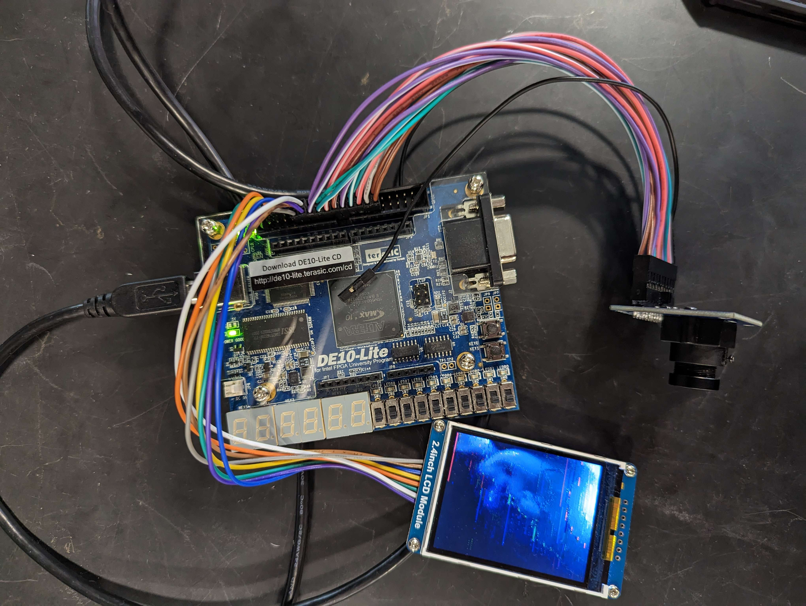

<!-- <!DOCTYPE html>
<html>
<head>
  <link href="https://fonts.google.com/specimen/Send+Flowers?query=flower" rel="stylesheet">
  
</head>

<body>
    

        
        

            <h2>Camera Project</h2>
            
This is a description of the camera project. Provide more details and information here.

        

    

</body>
</html> -->

<html>
  <head>
    <meta charset="utf-8">
    <link rel="stylesheet"
          href="https://fonts.googleapis.com/css?family=Tangerine">
    
  </head>
  <body>
    
Making the Web Beautiful!

  </body>
</html>

<!--
**Kittatata/Kittatata** is a ✨ _special_ ✨ repository because its `README.md` (this file) appears on your GitHub profile.

Here are some ideas to get you started:

- 🔭 I’m currently working on ...
- 🌱 I’m currently learning ...
- 👯 I’m looking to collaborate on ...
- 🤔 I’m looking for help with ...
- 💬 Ask me about ...
- 📫 How to reach me: ...
- 😄 Pronouns: ...
- ⚡ Fun fact: ...
-->
